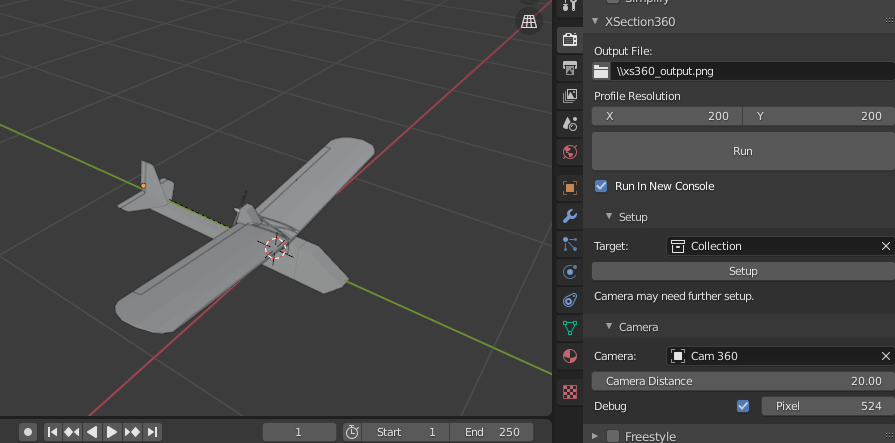
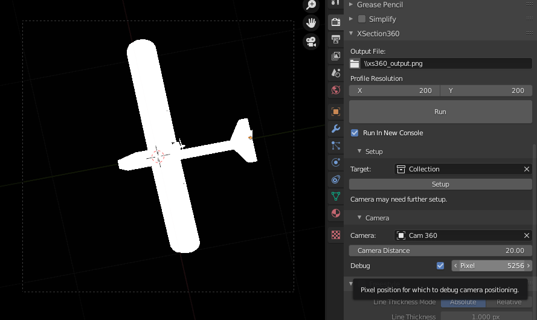
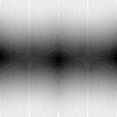

# XSection360
Bake cross sectional area profile of 3D object at various angles to image

## About
XSection360 is a Blender addon for creating calculating relative cross-sectional
of a 3D object, from different angles. It uses equirectangular projection to
calculate and render camera positions for each pixel in an output image profile.

For each rendered camera position, the addon calculates the total lightness of the image pixels and outputs it to output image profile.
This gives an indication of the relative cross-sectional area of the model from each position, as the models' material is set to solid white and the background to solid black.
        
The addon was written to create drag profiles of plane objects, for flight simulation.

## Installation

1. Download the latest XSection360 [release](https://github.com/tomnwright/XSection360/releases).
2. In Blender, go to Edit>Preferences>Add-ons>Install. Select the dowloaded zip file; click install.
3. Enable the addon. The XSection360 panel should appear in the Render Properties panel.

## How to Use
I advise first creating a dedicated Blend file or duplicating the working file.

1. In the XSection360 Setup panel, set the target collection. This collection should contain objects to be included.
2. Click the Setup button - the scene will automatically be setup for XS360 processing, including:
    * Mesh objects are copied from the target collection to a new one.
    * World background is set to black; mesh material set to flat white
    * Eevee settings configured
    * A new camera is generated in the new collection

3. Use the camera debugger to make sure all objects are in frame from every angle.
    * Configure object position and camera ortho size
    * Centre objects; camera rotates about the World Origin
    

5) Set an output png file; click Run to render.
    * "Run in New Console" is recommended, as a new console window can be cancelled.

6) Wait for XSection360 Render & Process to complete
    * IMPORTANT: do not open the render file during rendering. This will cause an access error, terminating the script.

### Example Output
This profile was output from the plane model shown in the above screenshots.

In this image, black shows directions in which the model has lower cross-sectional surfaces area, and white higher.

The central horizontal black stripe reflects the fact that the wings contribute a much larger surface area when viewed from above or below.
The black is also more concentrated in the centre and edge of the image horizontally, as the plane is more streamlined in the forwards (and backwards) direction.

The image is quite grainy. This is because the render resolution (not output resolution) was too small. Increasing render resolution results in a much less grainy image:

A much better way would be to calculate the above mathematically.
